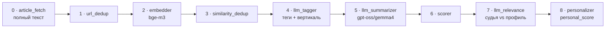

<div align="center">

# 🐹 Homyak

**Персональный агрегатор новостей с ИИ-ранжированием под твои интересы**

Собирает разнородные источники в единую дедуплицированную ленту, оценивает каждую новость
LLM-судьёй против твоего профиля и учится на твоих 👍/👎 — прямо в Telegram.


</div>

---

## ✨ Что это

Homyak превращает шум из десятков RSS-фидов и Telegram-каналов в **персональную ленту**, где наверху —
то, что интересно именно тебе. Три независимые тематические вертикали, локальные LLM, обучение в реальном
времени и читалка полного текста статьи прямо в Telegram.

Два архитектурных кита:
- 🔌 **Плагинная система адаптеров** — `sources` / `analyzers` / `outputs`. Ядро не знает о конкретике.
- ⚡ **Event-driven на NATS JetStream** — near-realtime, без polling'а БД и без Kafka.

---

## 🎯 Ключевые фичи

| | |
|---|---|
| 🧠 **Гибридный персональный ранкер** | `personal_score = LLM-судья + вектор вкуса + аффинити тегов/источников + свежесть − hard-mute` |
| 💼💻🩺 **3 независимые вертикали** | business / it / medical — у каждой свой профиль, обучение и лента |
| 👍👎 **Обучение на фидбеке** | реакции в боте двигают веса и вектор вкуса; каждая вертикаль учится отдельно |
| 📰 **Полный текст статьи** | фетчер (trafilatura) качает статью по URL, даже если RSS дал огрызок |
| 📄 **Читалка в Telegram** | кнопка → статья открывается нативным Instant View (Telegraph) |
| ✍️ **Инженерные саммари** | «о чём + что вынесешь», голосом senior-инженера, на языке оригинала |
| 🔀 **Semantic-дедуп** | одна новость из RSS и Telegram склеивается в один кластер по эмбеддингам |
| 🤖 **Авто-правки профиля** | раз в N реакций бот предлагает уточнить профиль (с подтверждением) |
| 🐳 **Одна команда** | весь стек в Podman: `podman compose up -d` |

---

## 🏗 Архитектура


Внутренняя шина — **NATS JetStream** (subjects: `items.*`, `feedback.recorded`, `telegram.raw`,
`profile.suggestion`). Ollama работает на хосте (Metal), контейнеры смотрят на `host.containers.internal`.

---

## 🧠 Конвейер обработки (9 стадий)



Analyzer'ы мутируют общий `AnalyzerContext`; дорогой `llm_relevance` кэшируется по версии профиля,
лёгкие компоненты пересчитываются на лету. При сбое — `nak` + exponential backoff, circuit breaker на Ollama.

---

## 📊 Три вертикали

Лента разделена на **3 независимые темы** — лайк в IT не влияет на medical.

| Вертикаль | Для кого | Источники |
|---|---|---|
| 💼 **Business** | трейдерам/бизнесменам — рынки, макро, «куда катится мир» | WSJ, Economist, MarketWatch, NYT, SeekingAlpha… |
| 💻 **IT** | инженерам — языки, системы, AI/ML, инфра | HN, arXiv, HuggingFace, lobsters, The Register… |
| 🩺 **Medical** | медикам — клиника, фарма, биотех | STAT, Lancet, Nature Medicine, Fierce, WHO… |

Вертикаль определяет **LLM-теггер по содержимому** (не по источнику). У каждой — свой профиль
(`config/profiles/*.yaml`), свой вектор вкуса и своё обучение.

---

## 🔄 Как учится

```
пуш новости под профиль  →  👍/👎/⭐/🔇 в боте  →  learner:
   👍 → тег/источник ↑, эмбеддинг в «вектор вкуса»
   👎 → тег/источник ↓
   🔇 → тема в mute (жёсткий фильтр)
раз в N реакций → LLM предлагает уточнить профиль (✅/❌)
```

`tag_affinity` и `source_affinity` — EMA в `[-1..1]`; вектор вкуса — инкрементальный центроид лайков
(обратимый по toggle). Cold-start: профиль словами работает с первого дня, вес вкуса нарастает по мере лайков.

---

## 🧰 Стек

| Слой | Технологии |
|---|---|
| Язык / пакеты | Python 3.13, **uv** |
| Web / ORM | FastAPI, SQLAlchemy 2.x (async), Alembic, asyncpg |
| Хранилища | Postgres 17 (метаданные + FTS), Qdrant (векторы 1024-dim) |
| Шина | NATS 2.10 + JetStream |
| LLM (Ollama, хост) | `bge-m3` (эмбеддинги), `qwen2.5:14b` (судья/теги), `gpt-oss:120b-cloud` → `gemma4` (саммари) |
| Извлечение | feedparser, trafilatura, httpx |
| Бот | aiogram 3.x + Telegraph |
| Деплой | Dockerfile + Podman compose |

---

## 🚀 Быстрый старт

**Требуется:** Podman (`podman compose`), Ollama на хосте с моделями.

```bash
# 1. модели Ollama (на хосте — Metal-ускорение)
ollama pull bge-m3
ollama pull qwen2.5:14b
ollama pull gemma4          # fallback для саммари

# 2. секреты
cp .env.example .env
#   впиши TELEGRAM_BOT_TOKEN (от @BotFather)

# 3. весь стек одной командой
podman compose up -d        # postgres, qdrant, nats + 7 app-сервисов

# 4. профили вертикалей
podman compose run --rm api homyak-profile-set

# 5. в Telegram → боту /start → /business /it /medical
```

`config/` примонтирован как volume — правки источников/профилей подхватываются без пересборки.

---

## 🤖 Бот

| Команда | Действие |
|---|---|
| `/business` `/it` `/medical` | лента вертикали (топ под профиль) |
| `/digest [N]` | топ по всем вертикалям |
| `/profile` | мои 3 профиля |
| `/stats` | статистика обучения (👍/👎, вкус) |
| `/why <id>` | разбор скоринга статьи |
| `/sources` · `/source <фид>` | источники / лента одного фида |
| `/mute <тема>` · `/threshold` · `/pause` | мьют / порог пуша / пауза |

Под каждым постом: **👍 👎 ⭐ 🔇 · 📄 текст · 🔗** — реакции обучают ранкер, 📄 открывает читалку.

---

## ⚙️ Конфигурация

- **Источники** — `config/sources.yaml` (RSS: url, интервал, вес; Miniflux). Telegram — через tscrapper→NATS.
- **Профили** — `config/profiles/{business,it,medical}.yaml` (описание + темы с polarity: love/like/mute).
- **Секреты** — только `.env` (в git не попадают): `TELEGRAM_BOT_TOKEN`, `DATABASE_URL`, веса скоринга, пороги.

---

## 🔧 Процессы (сервисы)

| Сервис | Роль |
|---|---|
| `ingest-poll` | опрос RSS/Miniflux по расписанию |
| `telegram-ingest` | приём Telegram-сообщений из NATS (tscrapper) |
| `processor` | 9-стадийный конвейер обработки |
| `learner` | обучение на фидбеке + авто-правки профиля |
| `sweeper` | переопубликация зависших items |
| `tgbot` | Telegram-бот (пуш, реакции, команды) |
| `api` | FastAPI: `/feed`, `/feed.rss`, `/feed.json`, `/feed/stream` (SSE), `/healthz` |

CLI: `homyak-cli` (лента в терминале), `homyak-profile-set`, `homyak-reembed`.

---

## 📁 Структура

```
homyak/
  core/        interfaces · events (NATS) · config · scoring · llm · article · telegraph · verticals
  storage/     postgres (repo) · qdrant · db
  adapters/
    sources/   rss · miniflux · telegram_relay
    analyzers/ article_fetch · url_dedup · embedder · similarity_dedup ·
               llm_tagger · llm_summarizer · scorer · llm_relevance · personalizer
    outputs/   api · tg_bot · cli · rss_out · json_feed · sse
  pipeline/    ingest_poll · telegram_ingest · processor · learner · sweeper · serve
  cli/         reembed · profile
alembic/       миграции 0001–0007
config/        sources.yaml · profiles/*.yaml
docs/          architecture.md · phase-*.md
```

---

## 📚 Документация

- [`docs/architecture.md`](docs/architecture.md) — архитектура, схема БД, конвейер, вертикали, failure modes
- [`docs/phase-1-skeleton.md`](docs/phase-1-skeleton.md) … [`docs/phase-6-personalization.md`](docs/phase-6-personalization.md) — планы фаз
- [`CLAUDE.md`](CLAUDE.md) — конвенции и запуск для разработки

---

<div align="center">

Персональный pet-project · собран с локальными LLM · 🐹

</div>
