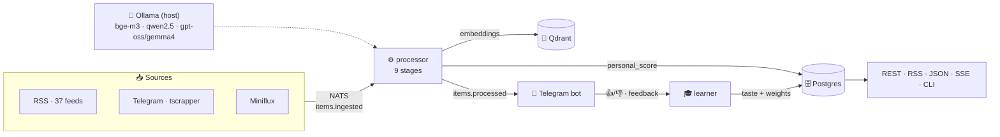
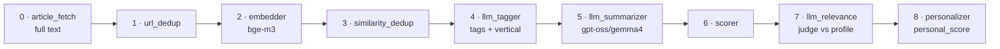

<div align="center">

# 🐹 Homyak

**A personal news aggregator with AI ranking tuned to your interests**

Pulls heterogeneous sources into one deduplicated feed, scores every story with an LLM judge
against your profile, and learns from your 👍/👎 — right inside Telegram.

**English** · [Русский](README.ru.md)


</div>

---

## ✨ What it is

Homyak turns the noise of dozens of RSS feeds and Telegram channels into a **personal feed** where what
matters to *you* floats to the top. Three independent topic verticals, local LLMs, real-time learning, and
a full-text article reader right in Telegram.

Two architectural pillars:
- 🔌 **Plugin adapter system** — `sources` / `analyzers` / `outputs`. The core knows nothing about specifics.
- ⚡ **Event-driven on NATS JetStream** — near-realtime, no DB polling, no Kafka.

---

## 🎯 Key features

| | |
|---|---|
| 🧠 **Hybrid personal ranker** | `personal_score = LLM judge + taste vector + tag/source affinity + freshness − hard-mute` |
| 💼💻🩺 **3 independent verticals** | business / it / medical — each with its own profile, learning and feed |
| 👍👎 **Learning from feedback** | reactions in the bot shift weights and the taste vector; each vertical learns separately |
| 📰 **Full article text** | fetcher (trafilatura) downloads the article by URL even when RSS gives a stub |
| 📄 **In-Telegram reader** | button → the article opens in a native Instant View (Telegraph) |
| ✍️ **Engineer-grade summaries** | “what it is + what you'll take away”, senior-engineer voice, in the original language |
| 🔀 **Semantic dedup** | the same story from RSS and Telegram merges into one cluster by embeddings |
| 🤖 **Auto profile refinement** | every N reactions the bot proposes a profile tweak (with confirmation) |
| 🐳 **One command** | the whole stack in Podman: `podman compose up -d` |

---

## 🏗 Architecture



The internal bus is **NATS JetStream** (subjects: `items.*`, `feedback.recorded`, `telegram.raw`,
`profile.suggestion`). Ollama runs on the host (Metal); containers reach it via `host.containers.internal`.

---

## 🧠 Processing pipeline (9 stages)



Analyzers mutate a shared `AnalyzerContext`; the expensive `llm_relevance` is cached by profile version,
lightweight components are recomputed on read. On failure — `nak` + exponential backoff, circuit breaker on Ollama.

---

## 📊 Three verticals

The feed is split into **3 independent topics** — a like in IT doesn't affect medical.

| Vertical | Audience | Sources |
|---|---|---|
| 💼 **Business** | traders/founders — markets, macro, “where the world is heading” | WSJ, Economist, MarketWatch, NYT, SeekingAlpha… |
| 💻 **IT** | engineers — languages, systems, AI/ML, infra | HN, arXiv, HuggingFace, lobsters, The Register… |
| 🩺 **Medical** | clinicians — clinical, pharma, biotech | STAT, Lancet, Nature Medicine, Fierce, WHO… |

The vertical is decided by the **LLM tagger from content** (not by source). Each has its own profile
(`config/profiles/*.yaml`), its own taste vector and its own learning.

---

## 🔄 How it learns

```
push story matching profile  →  👍/👎/⭐/🔇 in the bot  →  learner:
   👍 → tag/source ↑, embedding into the "taste vector"
   👎 → tag/source ↓
   🔇 → topic muted (hard filter)
every N reactions → LLM proposes a profile refinement (✅/❌)
```

`tag_affinity` and `source_affinity` are EMA in `[-1..1]`; the taste vector is an incremental centroid of
likes (reversible on toggle). Cold-start: the text profile works from day one, taste weight ramps up with likes.

---

## 🧰 Stack

| Layer | Tech |
|---|---|
| Language / packaging | Python 3.13, **uv** |
| Web / ORM | FastAPI, SQLAlchemy 2.x (async), Alembic, asyncpg |
| Storage | Postgres 17 (metadata + FTS), Qdrant (1024-dim vectors) |
| Bus | NATS 2.10 + JetStream |
| LLM (Ollama, host) | `bge-m3` (embeddings), `qwen2.5:14b` (judge/tags), `gpt-oss:120b-cloud` → `gemma4` (summaries) |
| Extraction | feedparser, trafilatura, httpx |
| Bot | aiogram 3.x + Telegraph |
| Deploy | Dockerfile + Podman compose |

---

## 🚀 Quick start

**Requires:** Podman (`podman compose`), Ollama on the host with models.

```bash
# 1. Ollama models (on the host — Metal acceleration)
ollama pull bge-m3
ollama pull qwen2.5:14b
ollama pull gemma4          # summary fallback

# 2. secrets
cp .env.example .env
#   set TELEGRAM_BOT_TOKEN (from @BotFather)

# 3. the whole stack in one command
podman compose up -d        # postgres, qdrant, nats + 7 app services

# 4. vertical profiles
podman compose run --rm api homyak-profile-set

# 5. in Telegram → /start → /business /it /medical
```

`config/` is mounted as a volume — source/profile edits are picked up without rebuilding.

---

## 🤖 Bot

| Command | Action |
|---|---|
| `/business` `/it` `/medical` | vertical feed (top matches for your profile) |
| `/digest [N]` | top across all verticals |
| `/profile` | my 3 profiles |
| `/stats` | learning stats (👍/👎, taste) |
| `/why <id>` | score breakdown for a story |
| `/sources` · `/source <feed>` | sources / one feed's stream |
| `/mute <topic>` · `/threshold` · `/pause` | mute / push threshold / pause |

Under each post: **👍 👎 ⭐ 🔇 · 📄 text · 🔗** — reactions train the ranker, 📄 opens the reader.

---

## ⚙️ Configuration

- **Sources** — `config/sources.yaml` (RSS: url, interval, weight; Miniflux).
- **Profiles** — `config/profiles/{business,it,medical}.yaml` (description + topics with polarity: love/like/mute).
- **Secrets** — `.env` only (never committed): `TELEGRAM_BOT_TOKEN`, `DATABASE_URL`, scoring weights, thresholds.

### 📡 Telegram via tscrapper

Telegram channels come from **[tscrapper](https://github.com/maks/tscrapper)** — a *separate service*
(Telethon, its own Telegram session) that monitors ~50 channels. It was extended to publish every message to
NATS (`homyak.telegram.raw`, best-effort, without breaking its forwarding); Homyak's `telegram-ingest`
consumes it → the normal pipeline. tscrapper runs on the host and reaches the containerized NATS on `:4222`.

---

## 🔧 Services

| Service | Role |
|---|---|
| `ingest-poll` | poll RSS/Miniflux on a schedule |
| `telegram-ingest` | consume Telegram messages from NATS (tscrapper) |
| `processor` | the 9-stage processing pipeline |
| `learner` | learning from feedback + auto profile refinement |
| `sweeper` | re-publish stuck items |
| `tgbot` | Telegram bot (push, reactions, commands) |
| `api` | FastAPI: `/feed`, `/feed.rss`, `/feed.json`, `/feed/stream` (SSE), `/healthz` |

CLI: `homyak-cli` (feed in the terminal), `homyak-profile-set`, `homyak-reembed`.

---

## 📁 Layout

```
homyak/
  core/        interfaces · events (NATS) · config · scoring · llm · article · telegraph · verticals
  storage/     postgres (repo) · qdrant · db
  adapters/
    sources/   rss · miniflux · telegram_relay
    analyzers/ article_fetch · url_dedup · embedder · similarity_dedup ·
               llm_tagger · llm_summarizer · scorer · llm_relevance · personalizer
    outputs/   api · tg_bot · cli · rss_out · json_feed · sse
  pipeline/    ingest_poll · telegram_ingest · processor · learner · sweeper · serve
  cli/         reembed · profile
alembic/       migrations 0001–0007
config/        sources.yaml · profiles/*.yaml
docs/          architecture.md · phase-*.md
```

---

## 📚 Documentation

- [`docs/architecture.md`](docs/architecture.md) — architecture, DB schema, pipeline, verticals, failure modes
- [`docs/phase-1-skeleton.md`](docs/phase-1-skeleton.md) … [`docs/phase-6-personalization.md`](docs/phase-6-personalization.md) — phase plans
- [`CLAUDE.md`](CLAUDE.md) — conventions and dev run

---

<div align="center">

Personal pet project · built with local LLMs · 🐹

</div>
