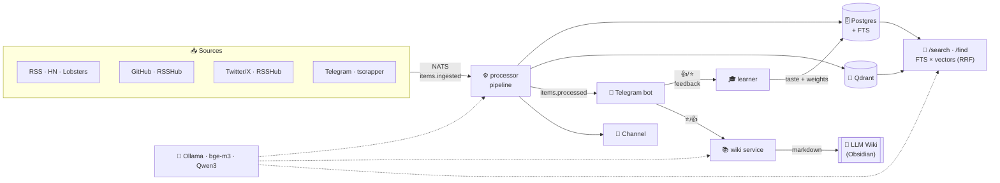

<div align="center">

# 🐹 Homyak

**A personal news aggregator with AI ranking — and a knowledge base that builds itself**

Pulls dozens of heterogeneous sources into one deduplicated feed, scores every story with an LLM judge
against your profile, learns from your 👍/👎 in Telegram — and compounds what you save into a self-maintaining
**LLM wiki** you can search and ask.

**English** · [Русский](README.ru.md)


</div>

---

## ✨ What it is

Homyak turns the noise of dozens of RSS feeds, GitHub, Twitter/X and Telegram channels into a **personal feed**
where what matters to *you* floats to the top — then lets you **search** everything it ever collected and grows
a **compounding knowledge base** from the stories you keep.

Three architectural pillars:
- 🔌 **Plugin adapters** — `sources` / `analyzers` / `outputs`. The core knows nothing about specifics.
- ⚡ **Event-driven on NATS JetStream** — near-realtime, no DB polling, no Kafka.
- 🧠 **Local LLMs end to end** — tagging, judging, summarizing, the wiki — all on your own Ollama.

---

## 🎯 Key features

| | |
|---|---|
| 🧠 **Hybrid personal ranker** | `personal_score = LLM judge + taste vector + tag/source affinity + freshness − hard-mute` |
| 💼💻🩺 **3 independent verticals** | business / it / medical — each with its own profile, learning and feed |
| 👍👎 **Learning from feedback** | reactions in the bot shift weights and the taste vector; each vertical learns separately |
| 🔎 **Hybrid search** | `/search` + bot `/find` — Postgres FTS × Qdrant vectors fused by RRF, cluster-collapsed |
| 📚 **Self-building LLM wiki** | ⭐/👍 compound into an interlinked markdown knowledge base (Karpathy-style), Obsidian-viewable |
| 💬 **Ask your feed** | `/ask` and the search **Answer** button synthesize grounded digests with citations |
| 🐙 **GitHub discovery** | trending per language (no token needed), plus *who publishes / stars what* — right in the IT feed |
| 🔀 **Semantic dedup** | the same story from RSS, GitHub, Twitter and Telegram merges into one cluster |
| ✍️ **Engineer-grade summaries** | technical voice, hard-locked to the article's language (RU→RU, else EN) |
| 🏷 **Auto titles** | sourceless posts (Telegram, tweets, bare links) get an LLM-written headline |
| 🤖 **Auto profile refinement** | every N reactions the bot proposes a profile tweak (with confirmation) |
| 🐳 **One command** | the whole stack in Podman/Docker compose |

---

## 🏗 Architecture



Internal bus: **NATS JetStream** (`items.*`, `feedback.recorded`, `telegram.raw`, `profile.suggestion`).
LLMs run on Ollama (a GPU box, with a local Metal fallback). Full architecture: [`docs/architecture.md`](docs/architecture.md).

---

## 🧠 Processing pipeline

```mermaid
flowchart LR
    A["article_fetch<br/>full text · GitHub README"] --> B["url_dedup"]
    B --> W["watchlist_matcher"] --> C["embedder<br/>bge-m3"] --> D["similarity_dedup"]
    D --> P["prefilter<br/>noise gate"] --> T["title_gen<br/>LLM headline"]
    T --> E["llm_tagger<br/>tags + vertical"] --> F["llm_summarizer"]
    F --> G["scorer"] --> H["llm_relevance<br/>judge vs profile"]
    H --> I["personalizer<br/>personal_score"]
```



Analyzers mutate a shared `AnalyzerContext`, ordered by `stage`. The expensive `llm_relevance` is cached by
profile version; lightweight components recompute on read. On failure — `nak` + exponential backoff, circuit
breaker on Ollama.

Rewriting an item's text (a late article fetch, a README backfill) marks its vector stale
(`embedding_version = NULL`); the sweeper re-embeds the queue in batches, so search never keeps matching
wording an item no longer holds.

---

## 🔎 Search & 📚 the LLM Wiki

Two layers over everything Homyak has ever ingested:

**Hybrid search** (`/search` page + bot `/find`) fuses two retrievers so you find things by exact term *and* by
meaning:
- **Lexical** — Postgres full-text on a persisted `tsvector` (names, acronyms, exact phrases).
- **Semantic** — the query embedded with bge-m3, nearest neighbours in Qdrant.
- **Fusion** — Reciprocal Rank Fusion merges the two ranks (no score calibration needed), then collapses
  clusters so one story shows once. Filter by vertical, period, or ⭐-saved-only.

**The LLM Wiki** (`homyak-wiki` service) is an adaptation of [Karpathy's LLM Wiki](https://x.com/karpathy) — and
it is **not RAG**. Instead of retrieving raw fragments per query, an LLM compiles the items you **⭐ save / 👍
like** into a compounding, interlinked markdown base:

```
wiki/
  concepts/   ideas, technologies, frameworks
  entities/   people, companies, tools
  sources/    one page per saved item
  index.md · log.md · lint.md
```

Every save triggers **ingest**: the LLM extracts concepts & entities, merges each into its page as a dated
bullet with a `[[wikilink]]` back to the source (idempotent). **Query** reads the *synthesized* pages (not the
raw firehose) to answer with citations — that's what the search **Answer** button calls first, falling back to
feed RAG. A periodic **lint** flags weakly-linked pages. The `./wiki` folder is a plain Obsidian vault.

> Firehose + search = discovery. The ⭐-wiki = your distilled second brain.

---

## 📊 Three verticals

The feed is split into **3 independent topics** — a like in IT never touches medical.

| Vertical | Audience | Sources |
|---|---|---|
| 💼 **Business** | traders/founders — markets, macro, "where the world is heading" | WSJ, Economist, MarketWatch, NYT, SeekingAlpha… |
| 💻 **IT** | engineers — languages, systems, databases, observability, mobile, AI/ML, new projects | HN, Lobsters, GitHub trending, LWN, CNCF, OpenTelemetry, DuckDB, weeklies… |
| 🩺 **Medical** | clinicians — clinical, pharma, biotech | STAT, Lancet, Nature Medicine, Fierce, WHO… |

The vertical is decided by the **LLM tagger from content** (not the source). Each has its own profile
(`verticals` in `config/interests.yaml`), its own taste vector and its own learning.

---

## 🔄 How it learns

```
push story matching profile  →  👍/👎/⭐/🔇 in the bot  →
   👍/⭐  → tag/source affinity ↑, embedding into the "taste vector", page in the wiki
   👎     → tag/source affinity ↓
   🔇     → topic muted (hard filter)
every N reactions → LLM proposes a profile refinement (✅/❌)
```

`tag_affinity`/`source_affinity` are EMA in `[-1..1]`; the taste vector is an incremental centroid of likes
(reversible on toggle). Cold-start: the text profile works from day one, taste weight ramps up with likes.

---

## 🧰 Stack

| Layer | Tech |
|---|---|
| Language / packaging | Python 3.13, **uv** |
| Web / ORM | FastAPI, SQLAlchemy 2.x (async), Alembic, asyncpg |
| Storage | Postgres 17 (metadata + full-text), Qdrant (1024-dim vectors) |
| Bus | NATS 2.10 + JetStream |
| LLM (Ollama) | `bge-m3` (embeddings), **Qwen3** (judge / tags / summaries / wiki) with a local fallback |
| Bridges | **RSSHub** (GitHub, Twitter/X), tscrapper (Telegram) |
| Extraction | feedparser, trafilatura, GitHub API (repo READMEs), httpx |
| Bot | aiogram 3.x + Telegraph |
| Deploy | Dockerfile + compose (Podman / Docker) |

---

## 🚀 Quick start

**Requires:** Podman or Docker (`compose`), an Ollama reachable with the models pulled.

```bash
# 1. Ollama models
ollama pull bge-m3
ollama pull qwen3            # judge / tags / summaries / wiki (any capable Qwen3)

# 2. secrets
cp .env.example .env
#   set TELEGRAM_BOT_TOKEN (from @BotFather), OLLAMA_URL
#   optional: GITHUB_ACCESS_TOKEN (GitHub trending), TWITTER_AUTH_TOKEN (Twitter/X)

# 3. the whole stack in one command
podman compose up -d         # postgres, qdrant, nats + app services + RSSHub

# 4. vertical profiles
podman compose run --rm api homyak-interests apply

# 5. in Telegram → /start → /it /business /medical
```

`config/` and `./wiki` are mounted as volumes — source/profile edits and the wiki are live, no rebuild.

---

## 🤖 Bot

| Command | Action |
|---|---|
| `/it` `/business` `/medical` | vertical feed (top matches for your profile) |
| `/find <query>` | hybrid search over everything collected |
| `/ask <question>` | grounded digest synthesized from the feed |
| `/digest [N]` | top across all verticals |
| `/profile` · `/stats` · `/why <id>` | profiles / learning stats / score breakdown |
| `/sources` · `/source <feed>` | sources / one feed's stream |
| `/mute <topic>` · `/threshold` · `/pushonly` · `/pause` | mute / push threshold / scope / pause |

Under each post: **👍 👎 ⭐ 🔇 · 📝 Разбор · 🔗** — reactions train the ranker *and* feed the wiki.
Web surfaces: **`/lenta`** (feed + reactions), **`/search`** (hybrid search + Answer), **`/dashboard`** (live pipeline).

---

## ⭐ The starred channel

Hit ⭐ on anything IT and it shows up in its own Telegram channel as a Russian card — original link,
the article's actual through-line, two or three concrete points. A top-5 digest of the day's feed goes
out at 10:00 and 23:00 so the channel keeps a pulse even on days nobody stars anything.

Each card is headed by an emoji picked from the item's tags (🦀 rust, 🛡 security, 🐛 a debugging story),
so the feed is scannable before you read a word of it.

The hard part isn't the summary, it's not inventing one. Guarantees, in order:

1. **No source text → no retelling.** A third of stars come from lobsters/hn/github with almost nothing
   stored; the service refetches the article at publish time and, failing that, ships a bare card.
2. **Grounding check** — every number and Latin proper noun in the summary must appear in the source, or
   that phrase is dropped. Pure function, unit-tested, no second LLM call.
3. **The prompt is tested on real stars** — `homyak-starcard-eval N --judge` rebuilds cards from actual ⭐
   items and has an independent judge list unsupported claims.

Config: `STAR_CHANNEL_ID`, `STAR_VERTICAL` (default `it`), `STAR_DIGEST_HOURS` (default `10,23`).

---

## 📤 Taking the good stuff out (`/saved`)

Everything you hit ⭐ (or 👍) on is a hand-picked set — `GET /saved` hands it to whatever you want to build
on top of it (export, newsletter, a page of your own):

```bash
curl 'http://homyak:8000/saved?limit=20'                   # newest starred first
curl 'http://homyak:8000/saved?sort=score&min_score=0.7'   # best of the starred
curl 'http://homyak:8000/saved?signal=any&kind=it&tag=llm' # ⭐+👍, IT, tagged llm
curl 'http://homyak:8000/saved?since=2026-08-01T00:00:00Z' # only marked since then
```

| Param | Values |
|---|---|
| `signal` | `save` (default, ⭐) · `up` (👍) · `any` |
| `sort` | `saved` (when you marked it, default) · `score` · `time` (publication) |
| `kind` | `all` · `it` · `business` · `medical` · `twitter` · `watch` |
| `tag` · `min_score` · `hours` | tag filter · personal-score floor · publication age window |
| `since` · `limit` · `offset` | ISO time of the *mark* · page size (≤500) · paging |

Each item carries `saved_at` and `signals` alongside the usual fields. For incremental sync, keep the
response's `latest_saved_at` and pass it back as `since` next time — no bookkeeping on your side.
`GET /saved.rss` and `GET /saved.json` serve the same set as RSS / JSON Feed for readers.

Marks are the human layer, so `/saved` deliberately ignores pipeline gates: if you starred it, you get it.

---

## ⚙️ Configuration

- **Sources** — `config/sources.yaml` (RSS/GitHub/Twitter: url, interval, weight). GitHub & Twitter go through
  a self-hosted **RSSHub**.
- **What I like** — `config/interests.yaml`, the SINGLE place: `verticals` (description + topics with
  polarity love/like/mute), `watch` (trending topics), `weights` (blend, push threshold, gate). Apply with
  `homyak-interests apply` (versioned in the DB); `diff` shows file/DB drift. Learned state (👍/👎 → affinity,
  🔇 mutes) lives in the DB and never writes back — the wall is one-way.
- **Secrets** — `.env` only (never committed): `TELEGRAM_BOT_TOKEN`, `OLLAMA_URL`, `DATABASE_URL`,
  `GITHUB_ACCESS_TOKEN`, `TWITTER_AUTH_TOKEN`, scoring weights, thresholds.

### 📡 Telegram via tscrapper

Telegram channels come from **tscrapper** — a *separate service* (Telethon, its own session) that monitors
~50 channels and publishes every message to NATS (`homyak.telegram.raw`, best-effort); Homyak's
`telegram-ingest` consumes it → the normal pipeline.

---

## 🔧 Services

| Service | Role |
|---|---|
| `ingest-poll` | poll RSS / GitHub / Twitter (via RSSHub) on a schedule |
| `telegram-ingest` | consume Telegram messages from NATS (tscrapper) |
| `processor` | the analyzer pipeline (dedup → title → tag → summarize → judge → personalize) |
| `learner` | learning from feedback + auto profile refinement |
| `wiki` | compound the LLM wiki from ⭐/👍 |
| `starchan` | ⭐ channel: starred items as Russian cards + daily digest |
| `sweeper` | re-publish stuck items · drain the re-embed queue |
| `tgbot` | Telegram bot (push, reactions, commands, search) |
| `api` | FastAPI: `/feed*`, `/saved*`, `/lenta`, `/search`, `/ask`, `/dashboard`, SSE |
| `rsshub` | RSS bridge for GitHub & Twitter/X |

CLI: `homyak-cli` · `homyak-interests` (show/diff/apply/backfill) · `homyak-reembed` ·
`homyak-backfill-titles` · `homyak-backfill-readme` · `homyak-resummarize` · `homyak-wiki-backfill` ·
`homyak-starcard-eval`.

---

## 📁 Layout

```
homyak/
  core/        interfaces · events (NATS) · config · scoring · llm · search · wiki* · titles ·
               ask · digest · trends · starcard · github · reembed
  storage/     postgres (repo) · qdrant · db
  adapters/
    sources/   rss · miniflux · telegram_relay
    analyzers/ article_fetch · url_dedup · watchlist_matcher · embedder · similarity_dedup ·
               prefilter · title_gen · llm_tagger · llm_summarizer · scorer · llm_relevance ·
               personalizer
    outputs/   api · tg_bot · dashboard · cli · rss_out · json_feed · sse
  pipeline/    ingest_poll · telegram_ingest · processor · learner · sweeper · wiki · starchan · serve
  cli/         reembed · interests · backfill_titles · backfill_readme · resummarize ·
               wiki_backfill · starcard_eval
alembic/       migrations
config/        sources.yaml · interests.yaml
wiki/          the LLM wiki (Obsidian vault, generated)
docs/          architecture.md · phase-*.md
```

---

## 📚 Documentation

- [`docs/architecture.md`](docs/architecture.md) — architecture, DB schema, pipeline, search, wiki, failure modes, key decisions
- [`docs/phase-1-skeleton.md`](docs/phase-1-skeleton.md) … [`docs/phase-6-personalization.md`](docs/phase-6-personalization.md) — phase plans
- [`CLAUDE.md`](CLAUDE.md) — conventions and dev run

---

## 📜 License

[GNU AGPL-3.0-or-later](LICENSE) — free software. Use it, study it, change it and share it; if you run a
modified version **as a network service**, its users must be able to get that source too. That network clause
is the point: it keeps derivatives open instead of quietly becoming someone's closed product.

Copyright © 2026 Maks K. Want it under different terms? Ask.

---

<div align="center">

Personal pet project · built with local LLMs · 🐹

</div>
