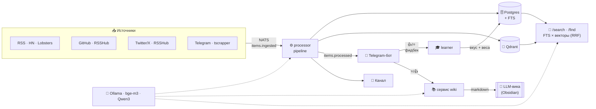
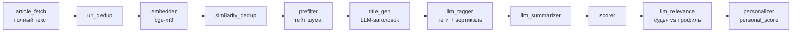

<div align="center">

# 🐹 Homyak

**Персональный агрегатор новостей с AI-ранжированием — и базой знаний, которая строит себя сама**

Сводит десятки разнородных источников в одну ленту без дублей, оценивает каждую новость LLM-судьёй под твой
профиль, учится на 👍/👎 прямо в Telegram — и накапливает сохранённое в самоподдерживающуюся **LLM-вику**,
по которой можно искать и спрашивать.

[English](README.md) · **Русский**


</div>

---

## ✨ Что это

Homyak превращает шум из десятков RSS, GitHub, Twitter/X и Telegram-каналов в **персональную ленту**, где важное
*тебе* всплывает наверх — а потом даёт **искать** по всему, что когда-либо собрано, и растит **компаундящуюся
базу знаний** из того, что ты сохранил.

Три архитектурных столпа:
- 🔌 **Плагинные адаптеры** — `sources` / `analyzers` / `outputs`. Ядро не знает про специфику.
- ⚡ **Event-driven на NATS JetStream** — почти realtime, без опроса БД, без Kafka.
- 🧠 **Локальные LLM от и до** — теги, судья, саммари, вика — всё на своей Ollama.

---

## 🎯 Ключевые фичи

| | |
|---|---|
| 🧠 **Гибридный персональный ранкер** | `personal_score = LLM-судья + вектор вкуса + affinity тегов/источников + свежесть − hard-mute` |
| 💼💻🩺 **3 независимые вертикали** | business / it / medical — у каждой свой профиль, обучение и лента |
| 👍👎 **Обучение на фидбеке** | реакции в боте двигают веса и вектор вкуса; каждая вертикаль учится отдельно |
| 🔎 **Гибридный поиск** | `/search` + бот `/find` — Postgres FTS × векторы Qdrant, слито RRF, схлоп кластеров |
| 📚 **Самостроящаяся LLM-вика** | ⭐/👍 компаундятся в связанную markdown-базу (по Карпатому), смотрится в Obsidian |
| 💬 **Спросить у ленты** | `/ask` и кнопка **Ответить** в поиске — заземлённые выжимки с цитатами |
| 🐙 **GitHub-дискавери** | trending, поиск по темам и *кто что публикует / звёздит* — прямо в IT-ленте |
| 🔀 **Семантический дедуп** | одна история из RSS, GitHub, Twitter и Telegram склеивается в один кластер |
| ✍️ **Инженерные саммари** | технарский тон, жёстко на языке статьи (RU→RU, иначе EN) |
| 🏷 **Авто-заголовки** | посты без заголовка (Telegram, твиты, голые ссылки) получают заголовок от LLM |
| 🤖 **Авто-уточнение профиля** | каждые N реакций бот предлагает правку профиля (с подтверждением) |
| 🐳 **Одна команда** | весь стек в Podman/Docker compose |

---

## 🏗 Архитектура



Внутренняя шина — **NATS JetStream** (`items.*`, `feedback.recorded`, `telegram.raw`, `profile.suggestion`).
LLM крутятся на Ollama (GPU-бокс, с локальным Metal-фолбэком). Полная архитектура: [`docs/architecture.ru.md`](docs/architecture.ru.md).

---

## 🧠 Пайплайн обработки



Анализаторы мутируют общий `AnalyzerContext`, порядок по `stage`. Дорогой `llm_relevance` кэшируется по версии
профиля; лёгкие компоненты пересчитываются на чтении. При сбое — `nak` + экспоненциальный backoff, circuit
breaker на Ollama.

---

## 🔎 Поиск и 📚 LLM-вика

Два слоя поверх всего, что Homyak когда-либо собрал:

**Гибридный поиск** (страница `/search` + бот `/find`) сливает два ретривера — находишь и по точному термину, и
по смыслу:
- **Лексика** — полнотекст Postgres по persisted `tsvector` (имена, аббревиатуры, точные фразы).
- **Смысл** — запрос эмбеддится bge-m3, ближайшие соседи в Qdrant.
- **Слияние** — Reciprocal Rank Fusion объединяет ранги (без калибровки очков), затем схлопывает кластеры —
  одна история показывается один раз. Фильтры: вертикаль, период, только ⭐-сохранённое.

**LLM-вика** (сервис `homyak-wiki`) — адаптация [LLM Wiki Карпатого](https://x.com/karpathy), и это **не RAG**.
Вместо выемки сырых кусков на каждый запрос LLM компилирует то, что ты **⭐ сохранил / 👍 лайкнул**, в
компаундящуюся связанную markdown-базу:

```
wiki/
  concepts/   идеи, технологии, фреймворки
  entities/   люди, компании, инструменты
  sources/    по странице на каждую сохранённую запись
  index.md · log.md · lint.md
```

Каждое сохранение запускает **ingest**: LLM извлекает концепты и сущности, мерджит их в страницы датированными
буллетами с `[[wikilink]]` на источник (идемпотентно). **Query** читает *синтезированные* страницы (а не сырой
firehose) и отвечает с цитатами — это и вызывает кнопка **Ответить** в поиске, с фолбэком на RAG по ленте.
Периодический **lint** помечает слабо-связанные страницы. Папка `./wiki` — обычный Obsidian-vault.

> Firehose + поиск = дискавери. ⭐-вика = твой выжатый второй мозг.

---

## 📊 Три вертикали

Лента разбита на **3 независимые темы** — лайк в IT не трогает medical.

| Вертикаль | Аудитория | Источники |
|---|---|---|
| 💼 **Business** | трейдеры/фаундеры — рынки, макро, «куда катится мир» | WSJ, Economist, MarketWatch, NYT, SeekingAlpha… |
| 💻 **IT** | инженеры — языки, системы, AI/ML, инфра, GitHub-проекты | HN, Lobsters, GitHub, HuggingFace, The Register… |
| 🩺 **Medical** | клиницисты — клиника, фарма, биотех | STAT, Lancet, Nature Medicine, Fierce, WHO… |

Вертикаль определяет **LLM-теггер по содержимому** (не источник). У каждой свой профиль (`verticals` в
`config/interests.yaml`), свой вектор вкуса и своё обучение.

---

## 🔄 Как учится

```
пуш новости под профиль  →  👍/👎/⭐/🔇 в боте  →
   👍/⭐  → affinity тегов/источников ↑, эмбеддинг в «вектор вкуса», страница в вике
   👎     → affinity тегов/источников ↓
   🔇     → тема замьючена (жёсткий фильтр)
каждые N реакций → LLM предлагает уточнить профиль (✅/❌)
```

`tag_affinity`/`source_affinity` — EMA в `[-1..1]`; вектор вкуса — инкрементальный центроид лайков (откатывается
на toggle). Cold-start: текстовый профиль работает с первого дня, вес вкуса нарастает с лайками.

---

## 🧰 Стек

| Слой | Технологии |
|---|---|
| Язык / упаковка | Python 3.13, **uv** |
| Web / ORM | FastAPI, SQLAlchemy 2.x (async), Alembic, asyncpg |
| Хранилище | Postgres 17 (метаданные + полнотекст), Qdrant (векторы 1024) |
| Шина | NATS 2.10 + JetStream |
| LLM (Ollama) | `bge-m3` (эмбеддинги), **Qwen3** (судья / теги / саммари / вика) + локальный фолбэк |
| Мосты | **RSSHub** (GitHub, Twitter/X), tscrapper (Telegram) |
| Извлечение | feedparser, trafilatura, httpx |
| Бот | aiogram 3.x + Telegraph |
| Деплой | Dockerfile + compose (Podman / Docker) |

---

## 🚀 Быстрый старт

**Нужны:** Podman или Docker (`compose`), доступная Ollama с моделями.

```bash
# 1. Модели Ollama
ollama pull bge-m3
ollama pull qwen3            # судья / теги / саммари / вика (любой способный Qwen3)

# 2. секреты
cp .env.example .env
#   задать TELEGRAM_BOT_TOKEN (от @BotFather), OLLAMA_URL
#   опционально: GITHUB_ACCESS_TOKEN (GitHub trending), TWITTER_AUTH_TOKEN (Twitter/X)

# 3. весь стек одной командой
podman compose up -d         # postgres, qdrant, nats + app-сервисы + RSSHub

# 4. профили вертикалей
podman compose run --rm api homyak-interests apply

# 5. в Telegram → /start → /it /business /medical
```

`config/` и `./wiki` смонтированы volume'ами — правки источников/профилей и вика живут без пересборки.

---

## 🤖 Бот

| Команда | Действие |
|---|---|
| `/it` `/business` `/medical` | лента вертикали (топ под твой профиль) |
| `/find <запрос>` | гибридный поиск по всему собранному |
| `/ask <вопрос>` | заземлённая выжимка по ленте |
| `/digest [N]` | топ по всем вертикалям |
| `/profile` · `/stats` · `/why <id>` | профили / статистика обучения / разбор скора |
| `/sources` · `/source <feed>` | источники / поток одного фида |
| `/mute <тема>` · `/threshold` · `/pushonly` · `/pause` | мьют / порог пуша / скоуп / пауза |

Под каждым постом: **👍 👎 ⭐ 🔇 · 📝 Разбор · 🔗** — реакции учат ранкер *и* кормят вику.
Веб-поверхности: **`/lenta`** (лента + реакции), **`/search`** (поиск + Ответить), **`/dashboard`** (live-пайплайн).

---

## ⚙️ Конфигурация

- **Источники** — `config/sources.yaml` (RSS/GitHub/Twitter: url, интервал, вес). GitHub и Twitter идут через
  self-hosted **RSSHub**.
- **Что я люблю** — `config/interests.yaml`, ЕДИНСТВЕННОЕ место: `verticals` (описание + темы с полярностью
  love/like/mute), `watch` (трендовые темы), `weights` (веса свёртки, порог пуша, гейт). Применять
  `homyak-interests apply` (профиль версионируется в БД); `diff` показывает расхождение файл/БД. Выученное
  (👍/👎 → affinity, 🔇 мьюты) живёт в БД и обратно не пишется — стена односторонняя.
- **Секреты** — только `.env` (не в git): `TELEGRAM_BOT_TOKEN`, `OLLAMA_URL`, `DATABASE_URL`,
  `GITHUB_ACCESS_TOKEN`, `TWITTER_AUTH_TOKEN`, веса скоринга, пороги.

### 📡 Telegram через tscrapper

Telegram-каналы приходят из **tscrapper** — *отдельного сервиса* (Telethon, своя сессия), который мониторит
~50 каналов и публикует каждое сообщение в NATS (`homyak.telegram.raw`, best-effort); `telegram-ingest`
консюмит → обычный пайплайн.

---

## 🔧 Сервисы

| Сервис | Роль |
|---|---|
| `ingest-poll` | опрос RSS / GitHub / Twitter (через RSSHub) по расписанию |
| `telegram-ingest` | консюм Telegram-сообщений из NATS (tscrapper) |
| `processor` | пайплайн анализаторов (дедуп → заголовок → теги → саммари → судья → персонализатор) |
| `learner` | обучение на фидбеке + авто-уточнение профиля |
| `wiki` | компаундит LLM-вику из ⭐/👍 |
| `sweeper` | переопубликация зависших |
| `tgbot` | Telegram-бот (пуш, реакции, команды, поиск) |
| `api` | FastAPI: `/feed*`, `/lenta`, `/search`, `/ask`, `/dashboard`, SSE |
| `rsshub` | RSS-мост для GitHub и Twitter/X |

CLI: `homyak-cli` · `homyak-interests` (show/diff/apply/backfill) · `homyak-reembed` ·
`homyak-backfill-titles` · `homyak-resummarize` · `homyak-wiki-backfill`.

---

## 📁 Раскладка

```
homyak/
  core/        interfaces · events (NATS) · config · scoring · llm · search · wiki* · titles · ask
  storage/     postgres (repo) · qdrant · db
  adapters/
    sources/   rss · miniflux · telegram_relay
    analyzers/ article_fetch · url_dedup · embedder · similarity_dedup · prefilter ·
               title_gen · llm_tagger · llm_summarizer · scorer · llm_relevance · personalizer
    outputs/   api · tg_bot · dashboard · cli · rss_out · json_feed · sse
  pipeline/    ingest_poll · telegram_ingest · processor · learner · sweeper · wiki · serve
  cli/         reembed · interests · backfill_titles · resummarize · wiki_backfill
alembic/       миграции
config/        sources.yaml · interests.yaml
wiki/          LLM-вика (Obsidian-vault, генерится)
docs/          architecture.ru.md · phase-*.md
```

---

## 📚 Документация

- [`docs/architecture.ru.md`](docs/architecture.ru.md) — архитектура, схема БД, пайплайн, поиск, вика, failure modes, ключевые решения
- [`docs/phase-1-skeleton.md`](docs/phase-1-skeleton.md) … [`docs/phase-6-personalization.md`](docs/phase-6-personalization.md) — планы фаз
- [`CLAUDE.md`](CLAUDE.md) — конвенции и dev-запуск

---

## 📜 Лицензия

[PolyForm Noncommercial 1.0.0](LICENSE) — **исходники открыты, но это не open source**. Читать, запускать,
менять и делиться — свободно в любых **некоммерческих** целях; **коммерческое использование запрещено**.
Нужна коммерческая лицензия — обратись к правообладателю.

---

<div align="center">

Персональный pet-проект · на локальных LLM · 🐹

</div>
